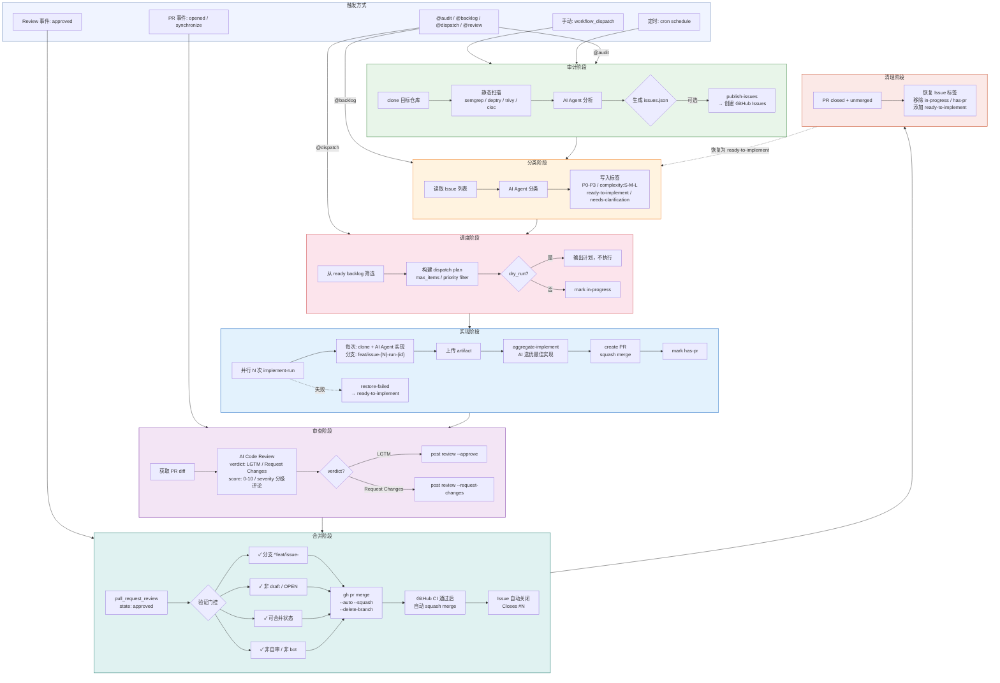

# Gearbox

> AI 驱动的 GitHub 仓库自动化飞轮系统

Gearbox 是开发母仓，用于维护源码、测试、文档、内部 workflow，并导出面向 GitHub Marketplace 的 `gearbox-action` 发布仓。

```
Audit -> Issue -> Backlog -> Implement -> Review -> Merge -> Report
```

## 项目概述

**1. 核心痛点**

传统开源项目从发现问题到代码合入全链路依赖人工：Issue 积压无人分类排优先级、开发者手动实现耗时数天、Code Review 成为吞吐瓶颈且合并决策缺乏标准化流程。Gearbox 基于 **Claude Agent SDK** 构建了全自动化闭环飞轮——从审计发现代码问题、自动创建 Issue、AI 分类排优先、调度实现、并行多方案竞争选优、AI Code Review，到 Review 通过后事件驱动自动合并，实现零人工干预。**项目当前仍在调试迭代阶段**，其前身 [gqy20/flywheel](https://github.com/gqy20/flywheel) 已完成多轮端到端实测与核心架构验证，后续正式迁移至 Gearbox 仓库继续迭代优化。

**2. 核心逻辑流**

系统基于 **Claude Agent SDK** 的 `query()` 接口驱动 5 个独立 Agent，形成 **Audit → Backlog → Dispatch → Implement → Review → Merge → Cleanup** 的完整流水线。**Audit 阶段**（每小时定时）通过静态扫描器获取仓库指纹后注入 Agent Prompt，3 个并行 Agent 审计并输出结构化 issues.json。**Backlog 阶段**（每2小时）3 个并行 AI Agent 对 Issue 自动打标（P0-P3 优先级 / S-M-L 复杂度 / 状态标签）。**Dispatch 阶段**（每小时**正式运行**）从 ready backlog 筛选 Issue 后直接进入 Implement（仅手动触发时默认 dry-run）。**Implement 阶段**对每个 Issue 启动 **3 个并行 Agent 竞争实现**（各最多 80 轮对话），Select Agent 选最优方案创建 PR。**Review 阶段**（PR 打开/同步/重新打开时**自动触发**）3 个并行 AI Review Agent 审查 PR diff，输出 verdict 与分级评论。**Merge 阶段**LGTM 判定触发 `pull_request_review` 事件，Auto-Merge 工作流经五层门控后执行 `--auto --squash`，CI 通过后自动合并并关闭关联 Issue。**与前身 flywheel 对比**：flywheel 采用 scan→evaluate→fix(3路并行)→仲裁合并的 Orchestrator 单链路编排模式（日均 ~200M tokens），Gearbox 在此经验上重构为模块化多 Agent 架构，新增独立 Backlog 分类、AI Code Review 和事件驱动 Auto-Merge 能力。

**3. 运行规模与资源消耗**

基于 GitHub Actions 实际运行日志：单次 Audit ~355K tokens、Review ~114K tokens、Dispatch 含 Implement ~160K-200K+ tokens。调度频率：Audit 每小时 1 次（~24 次/天）、Backlog 每2小时 1 次（~12 次/天）、Dispatch 每小时正式运行（~24 次/天）、Review 随 PR 自动触发（与 Dispatch 绑定，~24 次/天）。综合估算**单目标仓库日均总消耗约 50M–80M tokens**。通过熔断机制控制异常成本，面向更广泛仓库场景持续打磨。

## 完整流程



## 快速开始

```bash
uv sync

# CLI 本地调试
uv run gearbox --help
uv run gearbox agent audit-repo --repo owner/repo --output-dir ./audit-output
uv run gearbox publish-issues --input ./audit-output/issues.json

# 配置
uv run gearbox config set anthropic-api-key YOUR_KEY
uv run gearbox config list
```

## 本地验证

提交前可运行以下命令做基本检查：

```bash
uv run pytest
uv run ruff check .
uv run mypy src
```

## 当前架构

```text
轻量入口:
  gqy20/gearbox-action@v1
      |
      `-- 根 action.yml（由 actions/main 导出）
              |
              `-- actions/${{ inputs.action }}/action.yml

内部审计编排:
  .github/workflows/audit.yml
      |
      |-- plan
      |-- audit-run matrix（GitHub Actions 原生并行）
      |-- aggregate-audit
      `-- create-issues（可选）

内部 backlog 编排:
  .github/workflows/backlog.yml
      |
      |-- plan
      |-- backlog-run matrix（issue_number x run_id）
      `-- aggregate-backlog（按 issue 选优并写回标签/评论）

执行层:
  actions/*/action.yml
      |
      |-- actions/_runtime（CLI 运行时）
      `-- actions/_setup（audit 扫描工具）
              |
              `-- uv run gearbox agent ...
```

核心取舍：

- Marketplace 用户默认只需要调用 `gqy20/gearbox-action@v1`，不需要手写复杂脚本。
- 本仓库的 `audit.yml` 和 `backlog.yml` 使用 inline matrix 编排，这是当前验证过的内部入口。
- `reusable-*.yml` 仍保留为高级编排模板，但不再把本仓库主路径建立在本地 reusable 调用上。
- audit 执行前会先克隆目标仓库，scanner 与 Agent 都基于克隆目录运行，提示词中也会明确写入本地分析目录。

## GitHub Actions

### 本项目常用入口

```bash
# 审计当前项目
gh workflow run audit.yml

# 分类指定 Issue（单个 issue 是 backlog 的特例）
gh workflow run backlog.yml -f issues='123'

# 批量分类多个 Issue
gh workflow run backlog.yml -f issues='2,5,6'

# 审查指定 PR
gh workflow run review.yml -f pr_number=456

# 从 ready backlog 中选择最高优先级 Issue（默认 dry-run）
gh workflow run dispatch.yml
```

也可以在 Issue / PR 评论中用工作流专属 mention 触发，避免一次评论误触发多个流程：

- `@audit`：触发仓库审计。
- `@backlog`：触发当前 Issue 分类。
- `@dispatch`：从当前 Issue 或 ready backlog 触发实现计划（默认 dry-run）。
- `@review`：触发 PR 审查。

### 对外轻量接入

```yaml
- uses: gqy20/gearbox-action@v1
  with:
    action: audit
    repo: owner/repo
    anthropic_api_key: ${{ secrets.ANTHROPIC_AUTH_TOKEN }}
    anthropic_base_url: ${{ secrets.ANTHROPIC_BASE_URL }}
    model: ${{ vars.ANTHROPIC_MODEL }}
```

统一的 backlog 入口会根据 `issues` 数量自动选择行为：1 个 issue 时执行快速分类，多个 issue 时执行批量分类并逐个写回标签/评论。

Backlog 会写入类型标签、优先级标签、复杂度标签和状态标签。若仓库还没有
`P0`-`P3`、`complexity:S/M/L`、`ready-to-implement`，
运行时会先自动创建这些标签，再添加到对应 Issue。
日志中的“标签不存在，正在创建”是初始化提示；只有出现“创建标签失败”或
“添加标签失败”才表示写回失败。

```yaml
- uses: gqy20/gearbox-action@v1
  with:
    action: backlog
    repo: owner/repo
    issues: '2,5,6'
    anthropic_api_key: ${{ secrets.ANTHROPIC_AUTH_TOKEN }}
```

实现阶段使用 `dispatch`。它默认只输出计划，不创建 PR；确认选择逻辑可靠后，
显式设置 `dry_run: 'false'` 才会调用已有 Implement Agent。

```yaml
- uses: gqy20/gearbox-action@v1
  with:
    action: dispatch
    repo: owner/repo
    max_items: '1'
    dry_run: 'true'
    anthropic_api_key: ${{ secrets.ANTHROPIC_AUTH_TOKEN }}
```

### 高级 matrix 编排

如果调用方需要多实例并行、artifact 聚合、选优或批量创建 Issue，可以参考本仓库的 `.github/workflows/audit.yml`，或者使用保留的 reusable workflow 模板：

```yaml
jobs:
  audit:
    uses: gqy20/gearbox/.github/workflows/reusable-audit.yml@main
    with:
      repo: owner/repo
      benchmarks: github/copilot,sourcegraph/amp
      parallel_runs: '3'
      create_issues: false
    secrets: inherit
```

### 配置 Secrets / Variables

在 GitHub Repository `Settings -> Secrets and variables -> Actions` 中添加：

| Secret | 必须 | 说明 |
| --- | --- | --- |
| `ANTHROPIC_AUTH_TOKEN` | 是 | LLM Provider API Key |
| `ANTHROPIC_BASE_URL` | 否 | 自定义兼容网关地址 |
| `GH_PAT` | 否 | 需要跨仓库写入、创建 Issue 或发布 Marketplace 仓库时使用 |

| Variable | 默认值 | 说明 |
| --- | --- | --- |
| `ANTHROPIC_MODEL` | `glm-5-turbo` | 默认模型名 |

## 审计可观测性

audit action 现在会输出三个层级的日志：

- 运行配置：模型、base URL、最大轮次、工作目录、克隆策略。
- 静态扫描：克隆路径、文件数、代码行数、项目类型、各工具状态。
- Agent 流式事件：thinking 摘要、文本输出、工具调用名称和关键参数，例如 `Read path=...`、`Bash command=...`。

scanner 会优先使用 `cloc`、`deptry`、`semgrep`、`trivy`、`govulncheck` 等工具；如果部分工具不可用，会记录对应状态，并对基础文件数/行数做 fallback 统计。

## 发布

```bash
# 生成 gearbox-action 发布目录
uv run gearbox package-marketplace --output-dir ./dist/gearbox-action

# 预览某个版本的发布说明
uv run gearbox release-notes --version v1.1.2
```

发布约定：

- 开发仓使用 [CHANGELOG.md](CHANGELOG.md) 作为唯一版本说明来源。
- 每次打 `vX.Y.Z` tag 前，先补对应版本段落。
- `release-marketplace.yml` 会自动提取该版本条目，并写入 `gearbox-action` 的 GitHub Release notes。

## 项目结构

```text
gearbox/
├── actions/
│   ├── _runtime/                # 轻量运行时：uv、Python、gh、项目依赖
│   ├── _setup/                  # audit 扫描工具：semgrep、deptry、cloc、trivy 等
│   ├── main/                    # 内部路由层，导出时成为根 action.yml
│   ├── audit/                   # 审计 action
│   ├── backlog/                 # backlog 分类 action
│   ├── dispatch/                # 从 ready backlog 选择 Issue 并触发实现
│   ├── review/                  # 审查 action
│   ├── implement/               # 实现 action
│   └── publish/                 # 发布 action
├── .github/workflows/
│   ├── ci.yml                   # ruff / mypy / pytest
│   ├── audit.yml                # 当前验证过的内部 audit matrix 编排
│   ├── backlog.yml              # Issue/backlog 分类入口
│   ├── dispatch.yml             # ready backlog → implement PR 入口
│   ├── review.yml               # PR 审查入口
│   ├── reusable-*.yml           # 高级编排模板
│   └── release-marketplace.yml  # Marketplace 发布流程
└── src/gearbox/
    ├── cli.py                   # CLI 入口
    ├── core/                    # GitHub 操作封装
    ├── flow/                    # 确定性编排：dispatch 计划、排序、过滤
    └── agents/
        ├── *.py                 # 具体 Agent
        └── shared/              # runtime / structured / artifacts / scanner / selection
```

## 开发

```bash
uv sync

# 本地质量检查
uv run ruff check src tests
uv run ruff format --check src tests
uv run mypy src
uv run pytest -q

# 提交前检查
uvx pre-commit install
uvx pre-commit run --all-files
```

详见 [docs/index.md](docs/index.md) 了解完整架构设计与路线图。
